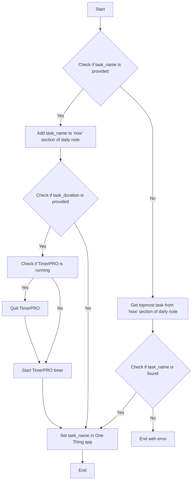

# now-task.py Execution Flow

```mermaid
graph TD
    A[Start] --> B{Check if task_name is provided}
    B -->|Yes| C[Add task_name to 'now' section of daily note]
    C --> D{Check if task_duration is provided}
    D -->|Yes| E[Check if TimerPRO is running]
    E -->|Yes| F[Quit TimerPRO]
    F --> G[Start TimerPRO timer]
    G --> H[Set task_name in One Thing app]
    D -->|No| H
    E -->|No| G
    B -->|No| I[Get topmost task from 'now' section of daily note]
    I --> J{Check if task_name is found}
    J -->|Yes| H
    J -->|No| K[End with error]
    H --> L[End]
```
